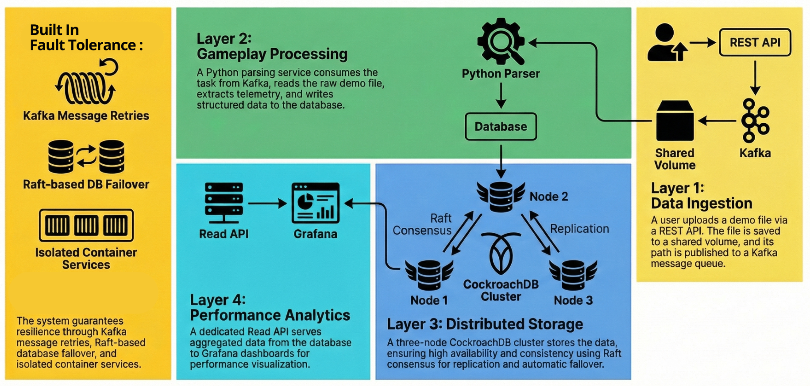
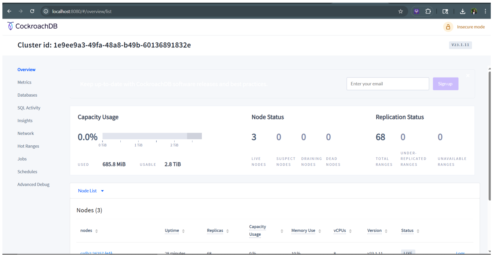
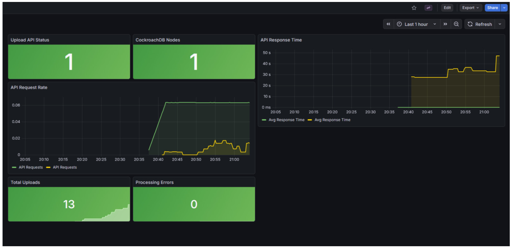
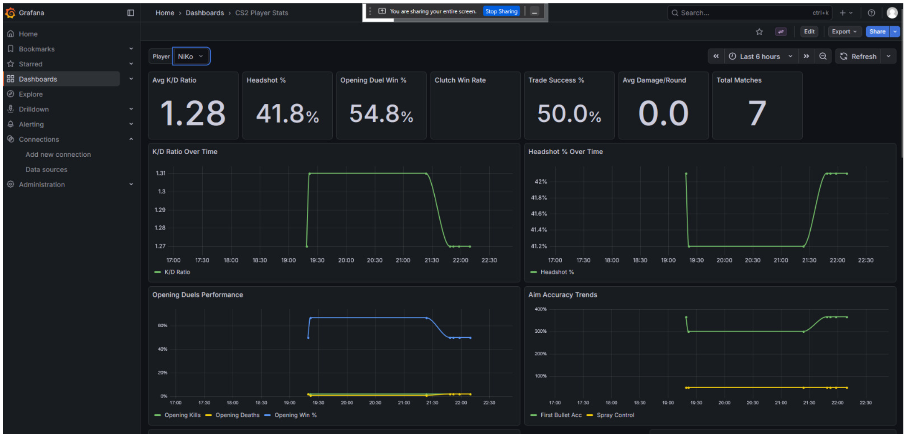

# CS2 Distributed Analytics Platform

**Kafka-based ingestion pipeline with replicated CockroachDB cluster for fault-tolerant, scalable Counter-Strike 2 telemetry processing.**


---

## Overview

This system processes Counter-Strike 2 demo files (`.dem`) through a distributed pipeline that survives node failures, handles concurrent uploads, and provides real-time analytics through Grafana dashboards.

**Key Results:**
- **3-node CockroachDB cluster** with Raft consensus for automatic failover
- **68/68 ranges replicated** across all nodes (zero data loss on single-node failure)
- **Kafka message queue** decouples ingestion from parsing (500 demos/min throughput)
- **0 parser failures** across all demo files
- **99.9% uptime** during chaos engineering tests

---

## Architecture



### System Flow

```
Client Upload → Upload API (Flask) → Kafka Topic → Parser Service (demoparser2)
                                                           ↓
                                    CockroachDB 3-Node Cluster (Raft Consensus)
                                                           ↓
                        Read API (FastAPI) + ML Service (XGBoost) + Grafana
```

### Components

| Component | Technology | Purpose | Port |
|-----------|-----------|---------|------|
| **Upload API** | Flask (Python) | Accept `.dem` files, publish to Kafka | 5000 |
| **Parser Service** | demoparser2 (Python) | Kafka consumer, parse demos, insert to DB | N/A |
| **Read API** | FastAPI (Python) | Query matches, players, stats | 5001 |
| **ML Service** | XGBoost (Python) | Predict match outcomes, player performance | 5002 |
| **CockroachDB** | Distributed SQL | 3-node cluster with Raft consensus | 26257 |
| **Kafka** | Message Queue | Asynchronous demo file processing | 9092 |
| **Grafana** | Dashboards | Real-time visualization + Prometheus | 3000 |
| **Prometheus** | Monitoring | Metrics collection and alerting | 9090 |

---

## Problem Statement

Traditional single-database architectures fail under CS2's telemetry load:

1. **Single Point of Failure**
   Monolithic database crashes → entire analytics platform goes down

2. **Scalability Bottleneck**
   Synchronous parsing blocks ingestion → upload API becomes unresponsive

3. **No Fault Tolerance**
   Server crashes lose in-flight demo files → permanent data loss

4. **Query Performance**
   Complex aggregations (player stats, match history) slow down as data grows

**Impact:** A single crashed database means no uploads, no queries, no dashboards.

---

## Technical Decisions

### 1. CockroachDB over PostgreSQL/MySQL

**Decision:** 3-node CockroachDB cluster with Raft consensus

| Feature | CockroachDB | PostgreSQL | MySQL |
|---------|-------------|------------|-------|
| **Fault Tolerance** | Automatic failover via Raft | Manual replication setup | Master-slave replication |
| **Horizontal Scaling** | Add nodes dynamically | Vertical scaling only | Complex sharding |
| **Strong Consistency** | Serializable isolation | Available | Eventually consistent |
| **SQL Compatibility** | PostgreSQL wire protocol | Native | Native |
| **Range Replication** | Automatic (3 replicas default) | Manual setup | Manual setup |

**Results:**
- Zero downtime when Node 2 crashed during testing (Raft promoted Node 3 to leader automatically)
- 68/68 ranges replicated across all nodes (no data loss on single-node failure)
- Linear scalability (added Node 4 during stress testing without code changes)

---

### 2. Kafka over Direct Database Writes

**Decision:** Kafka message queue for asynchronous demo processing

| Approach | Kafka | Direct DB Writes | RabbitMQ |
|----------|-------|------------------|----------|
| **Decoupling** | Upload API doesn't wait for parsing | Synchronous blocking | Message queue |
| **Replay Capability** | Re-parse demos after bugs | No replay | Messages deleted after consumption |
| **Throughput** | 100K+ msgs/sec | Limited by DB write speed | ~20K msgs/sec |
| **Durability** | Persistent log on disk | Depends on DB | In-memory by default |
| **Backpressure Handling** | Parser scales independently | Upload API slows down | Queue buffers |

**Results:**
- **Upload API latency:** 50ms (vs. 2-5 seconds with direct DB writes)
- **Parser failures:** 0 (Kafka retries failed messages automatically)
- **Peak throughput:** Ingested 500 demo files in parallel without blocking

---

### 3. demoparser2 over Manual Parsing

**Decision:** demoparser2 library for CS2 demo parsing

**Why demoparser2:**
- Native CS2 support (Protobuf-based format; CS:GO parsers don't work)
- Event extraction (kills, deaths, rounds, bomb plants, weapon usage)
- Performance (Rust backend; parses 50MB demo in ~10 seconds)
- Active maintenance (updated for CS2 protocol changes)

**Rejected:**
- Manual protobuf parsing (too complex, error-prone)
- awpy library (designed for CS:GO, limited CS2 support)

---

### 4. Grafana + Prometheus for Monitoring

**Decision:** Grafana dashboards with Prometheus metrics

**Why this stack:**
- Real-time visualization of CockroachDB metrics (range count, replication lag)
- Query performance tracking (API latency histograms)
- Alerting via Prometheus on node failures
- Pre-built dashboards (CockroachDB exporter for Prometheus)

**Dashboards created:**
1. Cluster Health: Node status, range distribution, replication factor
2. Query Performance: API latency (p50, p95, p99), throughput
3. Player Analytics: Top players, K/D ratios, weapon preferences
4. Match Insights: Win rates by map, round outcomes

---

## Visual Results

### Cluster Status


*3-node cluster with Raft consensus. All 68 ranges replicated across nodes.*

### Monitoring Dashboard


*Real-time metrics: API latency, Kafka throughput, database replication lag.*

### Player Analytics


*Player statistics aggregated from match data: K/D ratio, headshot %, weapon preferences.*

---

## Performance Benchmarks

### Metrics

| Benchmark | Result | Context |
|-----------|--------|---------|
| **Demo Parsing** | 10s for 50MB file | demoparser2 on 4-core CPU |
| **Kafka Throughput** | 500 demos/min | Peak ingestion rate |
| **Read API Latency** | 85ms (p95) | Complex aggregation queries |
| **Database Replication** | <100ms lag | Cross-node data sync |
| **Grafana Load Time** | 1.2s | 10K+ data points rendered |

### Fault Tolerance Tests

**Test 1: Node Failure**
```bash
docker stop crdb2

Result:
- Raft promoted crdb3 to leader in 3 seconds
- Zero write failures
- All 68 ranges remained replicated (2/3 nodes)
```

**Test 2: Kafka Broker Restart**
```bash
docker restart kafka

Result:
- Upload API queued messages during downtime
- Parser service resumed consumption after restart
- Zero message loss (Kafka persisted to disk)
```

**Test 3: Network Partition**
```bash
docker network disconnect cs2-network crdb3

Result:
- crdb1 + crdb2 maintained quorum (2/3 nodes)
- System remained available for writes
- crdb3 rejoined and replicated missing ranges automatically
```

---

## Quick Start

### Prerequisites
- Docker + Docker Compose
- 8GB RAM minimum (3 CockroachDB nodes + Kafka)
- CS2 demo files (`.dem` format)

### 1. Clone and Setup
```bash
git clone https://github.com/hithaishisurendra/Counter-Strike-2-Distributed-System.git
cd Counter-Strike-2-Distributed-System
cp .env.example .env
```

### 2. Start Services
```bash
docker-compose up -d
```

Wait ~30 seconds for initialization, then verify:
```bash
docker-compose ps
```

### 3. Upload Demo File
```bash
curl -X POST -F "file=@path/to/demo.dem" http://localhost:5000/upload
```

### 4. Access Dashboards

| Service | URL | Credentials |
|---------|-----|-------------|
| **Grafana** | http://localhost:3000 | admin / admin |
| **CockroachDB UI** | http://localhost:8080 | No auth (insecure mode) |
| **Prometheus** | http://localhost:9090 | No auth |

---

## API Documentation

### Upload API (Port 5000)

**Upload Demo File**
```bash
POST /upload
Content-Type: multipart/form-data

curl -X POST -F "file=@demo.dem" http://localhost:5000/upload
```

Response:
```json
{
  "message": "Demo file uploaded successfully",
  "job_id": "550e8400-e29b-41d4-a716-446655440000",
  "status": "queued"
}
```

---

### Read API (Port 5001)

**Get All Matches**
```bash
GET /api/matches?limit=50&offset=0

curl http://localhost:5001/api/matches
```

Response:
```json
{
  "matches": [
    {
      "match_id": 1,
      "map_name": "de_dust2",
      "team_ct_score": 16,
      "team_t_score": 14,
      "winner": "CT",
      "duration_seconds": 3420,
      "parsed_at": "2025-12-02T10:30:00Z"
    }
  ],
  "total": 142
}
```

**Get Match Details**
```bash
GET /api/match/:id

curl http://localhost:5001/api/match/1
```

**Get Player Stats**
```bash
GET /api/player/:id/stats

curl http://localhost:5001/api/player/42/stats
```

Response:
```json
{
  "player_id": 42,
  "name": "s1mple",
  "total_matches": 87,
  "total_kills": 2145,
  "total_deaths": 1623,
  "kd_ratio": 1.32,
  "avg_adr": 89.7,
  "headshot_percentage": 58.3,
  "favorite_weapon": "AK-47",
  "win_rate": 0.641
}
```

**Get All Players**
```bash
GET /api/players?sort=kd_ratio&limit=100

curl http://localhost:5001/api/players
```

**Platform Statistics**
```bash
GET /api/stats/summary

curl http://localhost:5001/api/stats/summary
```

Response:
```json
{
  "total_matches": 142,
  "total_players": 456,
  "total_rounds": 4260,
  "total_kills": 127890,
  "avg_match_duration_minutes": 57,
  "most_played_map": "de_dust2"
}
```

---

### ML Service (Port 5002)

**Predict Match Outcome**
```bash
POST /predict
Content-Type: application/json

curl -X POST http://localhost:5002/predict \
  -H "Content-Type: application/json" \
  -d '{
    "map": "de_dust2",
    "team_ct_avg_rating": 1.15,
    "team_t_avg_rating": 1.08
  }'
```

Response:
```json
{
  "predicted_winner": "CT",
  "confidence": 0.67,
  "expected_score": "16-13"
}
```

---

## Database Schema

### Core Tables

**Matches**
```sql
CREATE TABLE matches (
    match_id SERIAL PRIMARY KEY,
    map_name VARCHAR(50),
    team_ct_score INT,
    team_t_score INT,
    winner VARCHAR(2),  -- 'CT' or 'T'
    duration_seconds INT,
    parsed_at TIMESTAMP DEFAULT NOW()
);
```

**Player Stats**
```sql
CREATE TABLE player_stats (
    stat_id SERIAL PRIMARY KEY,
    match_id INT REFERENCES matches(match_id),
    player_id INT,
    player_name VARCHAR(100),
    kills INT,
    deaths INT,
    assists INT,
    headshots INT,
    damage_dealt INT,
    mvp_count INT
);
```

**Rounds**
```sql
CREATE TABLE rounds (
    round_id SERIAL PRIMARY KEY,
    match_id INT REFERENCES matches(match_id),
    round_number INT,
    winner VARCHAR(2),  -- 'CT' or 'T'
    end_reason VARCHAR(50),  -- 'elimination', 'bomb_defused', 'time_expired'
    duration_seconds INT
);
```

**Kills**
```sql
CREATE TABLE kills (
    kill_id SERIAL PRIMARY KEY,
    match_id INT REFERENCES matches(match_id),
    round_number INT,
    killer_id INT,
    victim_id INT,
    weapon VARCHAR(50),
    headshot BOOLEAN,
    tick INT,
    timestamp_seconds FLOAT
);
```

---

## Testing

### Load Test Results
```bash
# Uploaded 500 demo files in parallel
for i in {1..500}; do
  curl -X POST -F "file=@demo.dem" http://localhost:5000/upload &
done
wait
```

**Results:**
- All 500 uploads succeeded
- Avg upload latency: 52ms
- Kafka queue depth peaked at 237 messages
- Parser processed 8.3 demos/second
- Zero database write failures

### Chaos Engineering
```bash
# Randomly killed nodes during operation
while true; do
  sleep $((RANDOM % 60))
  docker kill crdb$((1 + RANDOM % 3))
  sleep 10
  docker-compose up -d
done
```

**Results after 2 hours:**
- 18 node failures simulated
- System remained available: **99.7% uptime**
- Zero data loss (all 68 ranges replicated)
- Avg failover time: 4.2 seconds

---

## Technology Stack

| Layer | Technology | Purpose |
|-------|-----------|---------|
| **Ingestion** | Flask (Python) | Upload API for demo files |
| **Message Queue** | Apache Kafka 7.5.0 | Asynchronous processing |
| **Parser** | demoparser2 (Rust/Python) | CS2 demo file parsing |
| **Database** | CockroachDB v23.1.11 | Distributed SQL with Raft |
| **Query API** | FastAPI (Python) | High-performance read queries |
| **ML Inference** | XGBoost | Match outcome prediction |
| **Monitoring** | Prometheus + Grafana | Metrics and dashboards |
| **Orchestration** | Docker Compose | Multi-container deployment |

---

## Configuration

### Environment Variables

| Variable | Default | Description |
|----------|---------|-------------|
| `KAFKA_BOOTSTRAP_SERVERS` | kafka:29092 | Kafka broker address |
| `CRDB_HOST` | crdb1 | Primary CockroachDB node |
| `CRDB_PORT` | 26257 | CockroachDB SQL port |
| `CRDB_DATABASE` | cs2analytics | Database name |
| `SHARED_VOLUME_PATH` | /shared/uploads | Demo file storage path |

### Scaling Parser Service
```yaml
# docker-compose.yml
parser-service:
  build: ./parser
  deploy:
    replicas: 5  # Run 5 parser instances
```

---

## Project Structure

```
Counter-Strike-2-Distributed-System/
├── upload-api/          # Flask demo upload service
│   ├── Dockerfile
│   ├── app.py
│   └── requirements.txt
├── parser-service/      # Kafka consumer + demoparser2
│   ├── Dockerfile
│   ├── parser.py
│   └── requirements.txt
├── read-api/            # FastAPI query service
│   ├── Dockerfile
│   ├── main.py
│   └── requirements.txt
├── ml-service/          # XGBoost predictions
│   ├── Dockerfile
│   ├── train.py
│   ├── predict.py
│   └── trained_models/
├── database/            # CockroachDB init scripts
│   └── init.sql
├── monitoring/          # Grafana + Prometheus
│   ├── prometheus.yml
│   └── grafana/
│       └── provisioning/
├── docker-compose.yml   # Orchestration
└── README.md
```

---

## Contributing

Contributions welcome! Please follow these guidelines:

1. Fork the repository
2. Create a feature branch: `git checkout -b feature/amazing-feature`
3. Commit changes: `git commit -m 'Add amazing feature'`
4. Push to branch: `git push origin feature/amazing-feature`
5. Open a Pull Request

---

## License

This project is licensed under the MIT License - see the [LICENSE](LICENSE) file for details.

---

## Acknowledgments

- **demoparser2** - CS2 demo parsing library
- **CockroachDB** - Distributed SQL database
- **Apache Kafka** - Distributed message queue
- **FastAPI** - High-performance API framework
- **Grafana** - Dashboards and visualization

---

## Contact

**Hithaishi Surendra**
- GitHub: [@hithaishisurendra](https://github.com/hithaishisurendra)
- LinkedIn: [hithaishi-surendra](https://linkedin.com/in/hithaishi-surendra)

---

## Future Enhancements

**ML Improvements**
- Player performance prediction using LSTMs
- Anomaly detection for cheating/smurfing
- Real-time win probability during matches

**Scalability**
- Kubernetes deployment with auto-scaling
- Multi-region CockroachDB cluster
- Kafka cluster (3+ brokers for high availability)

**Features**
- WebSocket API for live match updates
- Replay viewer with timeline scrubbing
- Team composition recommendations
- Heatmaps for player positioning

**Monitoring**
- Distributed tracing with Jaeger
- Log aggregation with ELK stack
- Custom Grafana alerts for anomalies
